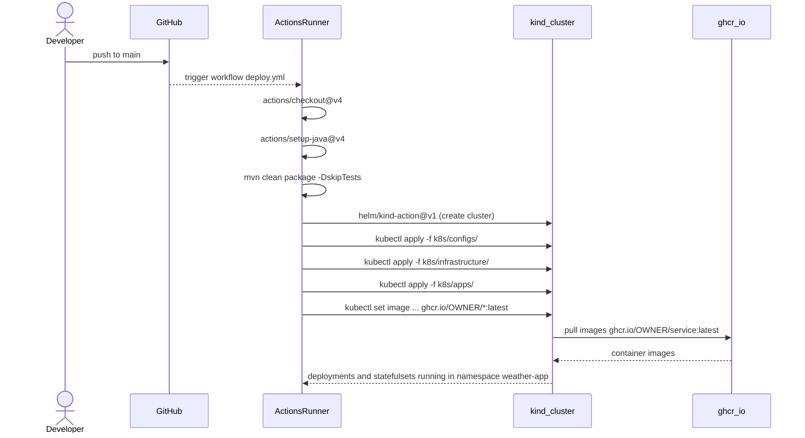

<!-- Generated by sourcery-ai[bot]: start review_guide -->

## Reviewer's Guide

Integrates the project with GitHub Container Registry and a GitHub Actions-based CI/CD pipeline by switching Kubernetes manifests to pull images from GHCR, simplifying deploy.sh to rely solely on manifests, scoping resources to a dedicated namespace, tuning config values, and adding a workflow that builds the app and deploys to a kind-based Kubernetes cluster on each push to main.

#### Sequence diagram for CI/CD deployment via GitHub Actions and GHCR

### File-Level Changes

| Change | Details | Files |
| ------ | ------- | ----- |
| Switch Kubernetes workloads to pull images from GitHub Container Registry instead of locally built images and scope them to a dedicated namespace. | <ul><li>Updated all application Deployments/StatefulSets to use ghcr.io/<owner>/<service>:latest images with imagePullPolicy Always.</li><li>Added namespace: weather-app to all app, infrastructure, and config Kubernetes manifests so resources are isolated.</li><li>Relaxed imagePullPolicy for infrastructure components (Elasticsearch, Kibana, Zookeeper) to IfNotPresent to allow normal pulling from public registries.</li></ul> | `k8s/apps/central-station.yaml` `k8s/apps/elasticsearch-client.yaml` `k8s/apps/kafka-stream.yaml` `k8s/apps/open-meteo-adapter.yaml` `k8s/apps/weather-station.yaml` `k8s/configs/weather-config.yaml` `k8s/infrastructure/elasticsearch.yaml` `k8s/infrastructure/kibana.yaml` `k8s/infrastructure/zookeeper.yaml` `k8s/configs/hadoop-config.yaml` `k8s/configs/pvc.yaml` `k8s/infrastructure/kafka.yaml` |
| Simplify local deployment script to rely on existing Kubernetes manifests without building or loading local Docker images. | <ul><li>Removed all docker build commands for the individual application services.</li><li>Removed all kind load docker-image and docker pull steps for app and infrastructure images.</li><li>Left the script responsible only for applying K8S configs, infrastructure, and app manifests.</li></ul> | `deploy.sh` |
| Tune runtime configuration parameters for smaller batch sizes and more frequent requests. | <ul><li>Decreased ingestion BATCH_SIZE and REQUEST_INTERVAL in the weather-config ConfigMap to lower-latency, smaller-batch processing.</li><li>Kept existing Kafka, Bitcask, and indexing-related configuration keys intact.</li></ul> | `k8s/configs/weather-config.yaml` |
| Introduce a GitHub Actions workflow that builds the project and deploys it into a kind-based Kubernetes cluster on the CI runner, using GHCR-hosted images. | <ul><li>Added a deploy.yml workflow triggered on pushes to main and manual dispatch.</li><li>Configured Java 21 toolchain and Maven build step.</li><li>Provisioned a kind cluster via helm/kind-action and set up kubectl.</li><li>Applied config, infrastructure, and app manifests into the weather-app namespace, then updated deployment and statefulset images to ghcr.io/<owner>/<service>:latest via kubectl set image.</li><li>Added a rollback job that attempts kubectl rollout undo for all app workloads if the deploy job fails.</li></ul> | `.github/workflows/deploy.yml` |
| Replaced the project README contents with third-party 'act' documentation and removed the original system description. | <ul><li>Deleted the entire original README describing the Weather Stations Monitoring System architecture, components, and usage.</li><li>Replaced it with documentation for the nektos/act project, including its overview, usage, support, and contribution sections, plus minimal Go build instructions.</li></ul> | `README.md` |

---

Tips and commands

#### Interacting with Sourcery

- **Trigger a new review:** Comment `@sourcery-ai review` on the pull request.
- **Continue discussions:** Reply directly to Sourcery's review comments.
- **Generate a GitHub issue from a review comment:** Ask Sourcery to create an
  issue from a review comment by replying to it. You can also reply to a
  review comment with `@sourcery-ai issue` to create an issue from it.
- **Generate a pull request title:** Write `@sourcery-ai` anywhere in the pull
  request title to generate a title at any time. You can also comment
  `@sourcery-ai title` on the pull request to (re-)generate the title at any time.
- **Generate a pull request summary:** Write `@sourcery-ai summary` anywhere in
  the pull request body to generate a PR summary at any time exactly where you
  want it. You can also comment `@sourcery-ai summary` on the pull request to
  (re-)generate the summary at any time.
- **Generate reviewer's guide:** Comment `@sourcery-ai guide` on the pull
  request to (re-)generate the reviewer's guide at any time.
- **Resolve all Sourcery comments:** Comment `@sourcery-ai resolve` on the
  pull request to resolve all Sourcery comments. Useful if you've already
  addressed all the comments and don't want to see them anymore.
- **Dismiss all Sourcery reviews:** Comment `@sourcery-ai dismiss` on the pull
  request to dismiss all existing Sourcery reviews. Especially useful if you
  want to start fresh with a new review - don't forget to comment
  `@sourcery-ai review` to trigger a new review!

#### Customizing Your Experience

Access your [dashboard](https://app.sourcery.ai) to:
- Enable or disable review features such as the Sourcery-generated pull request
  summary, the reviewer's guide, and others.
- Change the review language.
- Add, remove or edit custom review instructions.
- Adjust other review settings.

#### Getting Help

- [Contact our support team](mailto:support@sourcery.ai) for questions or feedback.
- Visit our [documentation](https://docs.sourcery.ai) for detailed guides and information.
- Keep in touch with the Sourcery team by following us on [X/Twitter](https://x.com/SourceryAI), [LinkedIn](https://www.linkedin.com/company/sourcery-ai/) or [GitHub](https://github.com/sourcery-ai).

<!-- Generated by sourcery-ai[bot]: end review_guide -->